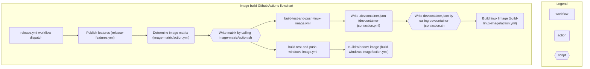

# Contributing to the RAPIDS devcontainers

This document contains implementation details and design overviews for
[rapidsai/devcontainers](https://github.com/rapidsai/devcontainers) as a
centralized source of common scripts and patterns for providing devcontainers.

For the user-level overview providing instructions on how to use the
devcontainer as a development environment, see
[USAGE_IN_PROJECT.md](USAGE_IN_PROJECT.md)

For a project maintainer-level overview providing instructions on how to add
and change .devcontainer.json to suit your project, see [USAGE.md](USAGE.md)

The code in this repository fits into a few main categories:

* Features
* GitHub Actions automations
* Scripts
* matrix.yml
* Dockerfiles

## Features

From the official devcontainer [documentation on Features](https://containers.dev/implementors/features/):
> Development container "Features" are self-contained, shareable units of installation code and development container configuration.

Each "feature" specified becomes a `RUN` statement in a temporary Dockerfile,
and as such each "feature" results in an image layer. The
[rapidsai/devcontainers repository](https://github.com/rapidsai/devcontainers)
defines `features` to install the following dev tools, compilers, and SDKs:

* [CMake](features/src/cmake/)
* [CUDA Toolkit](features/src/cuda/)
* [GCC](features/src/gcc/)
* [GitLab CLI](features/src/gitlab-cli/)
* [LLVM](features/src/llvm/)
* [Mambaforge](features/src/mambaforge/)
* [ninja-build](features/src/ninja/)
* [NVIDIA HPC SDK](features/src/nvhpc/)
* [Intel OneAPI compilers](features/src/oneapi/)
* [CCCL development utilities](features/src/cccl-dev/)
* [Rust](features/src/rust/)
* [sccache](features/src/sccache/)
* [devcontainer-utils](features/src/utils/)
* [rapids-build-utils](features/src/rapids-build-utils/)

Many of these feature scripts use apt utilities and thus only run on debian-based
images.

### Utility features

A few of the features install custom tools for the devcontainer environment,
rather than just installation scripts of external tools and libraries. A brief
overview of responsibilities for these features follows.

#### `rapids-build-utils`

The `rapids-build-utils` feature is a good place to start when investigating an
unknown command or behavior in a devcontainer. Most of the scripts in the this
feature prepare the devcontainer prior to use. The scripts from this project are
installed by [`install.sh`](./features/src/rapids-build-utils/install.sh). `install.sh`
creates aliases that begin with a `rapids-` prefix for the .sh scripts in the
[`rapids-build-utils` bin
folder](features/src/rapids-build-utils/opt/rapids-build-utils/bin).

The `rapids-build-utils` scripts can also be run manually to force an update the
devcontainer scripts after modifying a project's manifest.yml file to add new
projects or change dependencies. See
[USAGE.md](./USAGE.md#generating-scripts-for-other-projects-manifestyaml-file)
for more information on customizing manifest.yml.

> **NOTE:** Some scripts in downstream projects, especially those in `ci/`
folders, call scripts that start with the `rapids-` prefix but are not provided
by the `rapids-build-utils` feature. These `rapids-` prefixed scripts come from
the [gha-tools](https://github.com/rapidsai/gha-tools/tree/main/tools)
repository, which is part of the older RAPIDS unified CI configuration and not
currently part of the devcontainer features. To run the scripts in a project's
`ci` folder, use the images at
[rapidsai/ci-imgs](https://github.com/rapidsai/ci-imgs) instead of the
devcontainers.

#### devcontainers-utils

These scripts handle git-related configuration, setting up SSH deploy
keys, GitHub authorization, and the vault setup for S3. The commands here are
prefixed with `devcontainer-` during installation.

## Github Actions automations

Github Actions runs the build matrix of the many base images defined in [matrix.yml](./matrix.yml).
These actions are broken up into many reusable pieces. The image build jobs start in
[release.yml](./.github/workflows/release.yml).



These are divided into 3 categories in the diagram:
* Workflows are `.yml` files in `.github/workflows`
* Actions are folders in `.github/actions`. One folder per action. Actions must have a `action.yml` file, but may
also have accompanying shell scripts.
* Scripts are the shell scripts that are in some of the actions folders. They are broken out in this diagram to help
show that functionality can be defined outside of action.yml files.

## Base images (matrix.yml)

Base images are composed from individual features in [matrix.yml](./matrix.yml)
using [YAML
anchors](https://support.atlassian.com/bitbucket-cloud/docs/yaml-anchors/).
These get built on Github Actions as described
[above](#github-actions-automations) The devcontainers repo has some generic
scripts for generating, building and launch devcontainers in the scripts folder.
Some downstream repos have related, but more specialized scripts to facilitate
working with their subspace of the configuration matrix. An example is CCCL's
[make_devcontainers.sh](https://github.com/NVIDIA/cccl/blob/main/.devcontainer/make_devcontainers.sh)
script.

## Dockerfiles

Dockerfiles do not play much role in this scheme. They serve to [set a few global
variables and extend from the base image](./.devcontainer/rapids.Dockerfile).
Changes made to a Dockerfile are usually better achieved by adding or changing a feature
script instead.

## Build caching with `sccache`

The devcontainers configure CMake to use
[sccache](https://github.com/mozilla/sccache) as C, C++, CUDA, and Rust compiler
launchers. Refer to the [sccache
docs](https://github.com/mozilla/sccache/tree/main/docs) for configuring the
various storage back-ends.

### Build caching with private S3 buckets

A private S3 bucket can be used as the `sccache` storage back-end.

If you're using a [GitHub action](https://github.com/aws-actions/configure-aws-credentials) to assume AWS roles in CI, or are comfortable distributing and managing S3 credentials, you can define the `SCCACHE_BUCKET`, `AWS_ACCESS_KEY_ID`, and `AWS_SECRET_ACCESS_KEY` variables in the container environment.

### Using GitHub OAuth to issue S3 credentials via Hashicorp Vault

The [`devcontainer-utils`](features/src/utils/) feature includes a `devcontainer-utils-vault-s3-init` script that uses GitHub OAuth and Hashicorp Vault to issue temporary S3 credentials to authorized users.

> **NOTE:** This script runs in the devcontainer's [`postAttachCommand`](https://containers.dev/implementors/json_reference/#lifecycle-scripts), but it does nothing unless `SCCACHE_BUCKET` and `VAULT_HOST` are in the container environment.

The `devcontainer-utils-vault-s3-init` script performs the following actions, exiting early if any step is unsuccessful:

1. Log in via the [GitHub CLI](https://cli.github.com/)
2. Authenticate via [Vault's GitHub auth method](https://developer.hashicorp.com/vault/docs/auth/github#authentication)
3. Use Vault to [generate temporary AWS credentials](https://developer.hashicorp.com/vault/api-docs/secret/aws#generate-credentials)
4. Store results in `~/.aws` and install crontab to re-authenticate

The above steps can be customized via the following environment variables:
```
# The hostname of the Vault instance to use
VAULT_HOST="https://vault.ops.k8s.rapids.ai"

# List of GitHub organizations for which Vault can generate credentials.
# The scripts assumes the Vault instance exposes an authentication endpoint
# for each org at `$VAULT_HOST/v1/auth/github-$org/login`.
# https://developer.hashicorp.com/vault/docs/auth/github#authentication
VAULT_GITHUB_ORGS="nvidia nv-morpheus nv-legate rapids"

# The TTL for the generated AWS credentials
VAULT_S3_TTL=43200

# The URI to the Vault API that generates AWS credentials
# The full URL expands to `$VAULT_HOST/$VAULT_S3_URI?ttl=$VAULT_S3_TTL`
# https://developer.hashicorp.com/vault/api-docs/secret/aws#generate-credentials
VAULT_S3_URI="v1/aws/creds/devs"
```